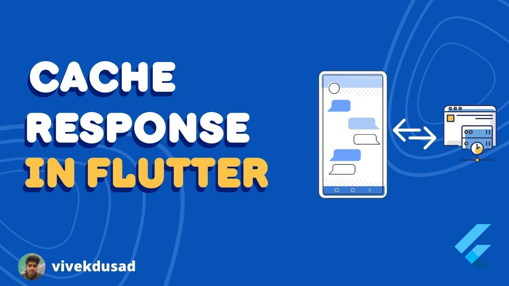

Caching of GET Requests which are less-frequently modified in database has been
a best practice for user experience. This leads to less consumption
of network bandwidth and leads to a greater user experience.

For achieving this we are going to use a basic concept of http protocol, **Etag**

## Etag

An ETag (entity tag) is an HTTP response header returned by an HTTP/1.1 compliant web server used to determine change in content at a given URL.

We can use Etag for caching purposes

```dart title="main.dart"
Future<Response> fetch(String etag) async {
    Response response = await _dio.get(Urls.appBannersEndpoint,
        options: Options(headers: {"If-None-Match": etag}));
    return response;
  }
```

**fetch** function will throw error with status code **304** if data is not modified in database or give response if data is modified with status code **200**.

## Procedure

1. Make First Request to server.
2. Store Etag and Response to Local Database.
3. Further Requests will be made through stored etag(demonstrated above in code).
4. If data is not modified, then exception will be thrown with status code 304. Then we give data to UI layer from local database.
5. If Requests ends with status code 200 then we will give this new data to UI layer.


```dart title="repository.dart"
Stream<List<Banners>> fetch() async* {
    var data;
    CacherDto? cachedData;
    //getting etag from local database
    try {
      cachedData = await responseCacher.readData(Urls.appBannersEndpoint);
    } catch (e) {
      print(e);
      cachedData = null;
    }
    try {
        //making requests to server
      Response response = (await service.fetch(cachedData?.etag ?? ""));
      await responseCacher.saveData(
          CacherDto(response.headers['etag']![0], response.data),
          Urls.appBannersEndpoint);
      data = response.data;
    } on DioError catch (_) {
        //if error occured then data will be set from 
        //local database
      data = cachedData?.data;
    } catch (e) {
      //! Add To Firebase
      throw "Failed! Try Again Later";
    }
    if (data != null) {
      yield (data as List).map((e) => Banners.fromJson(e)).toList();
    }
  }
```


